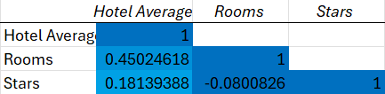
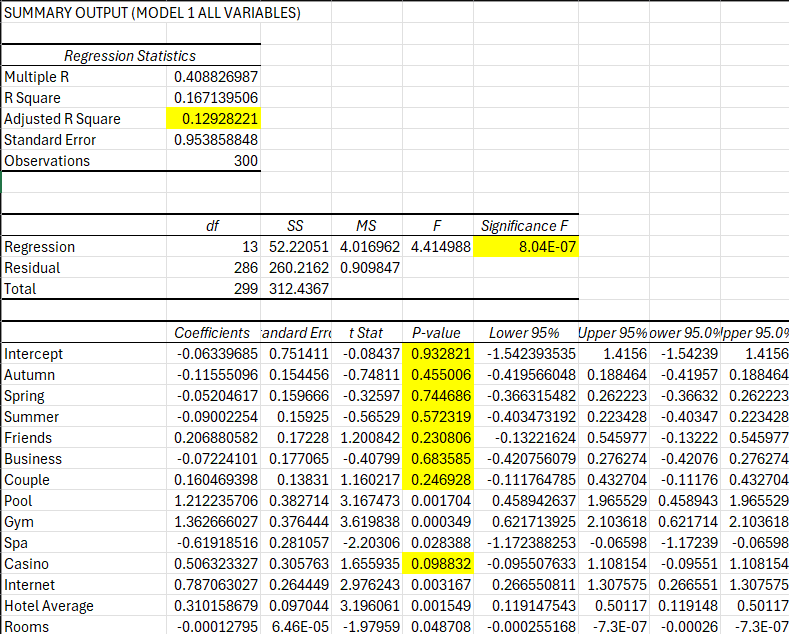
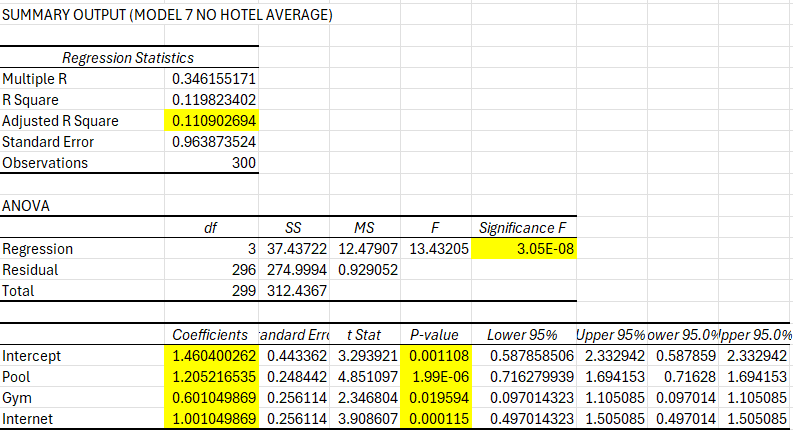
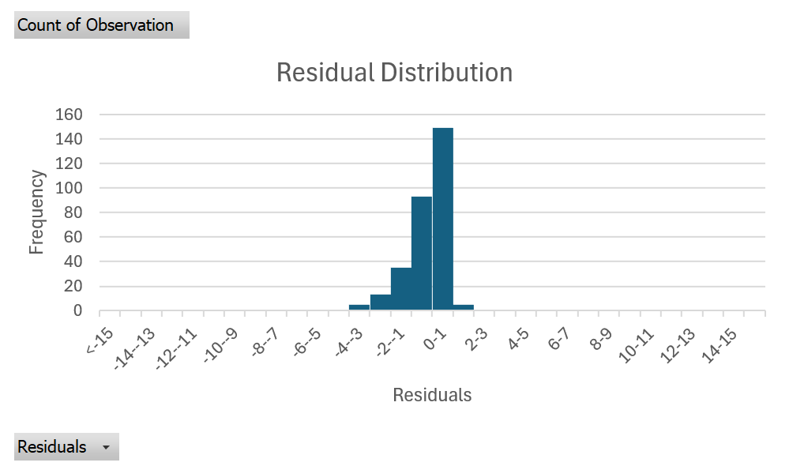
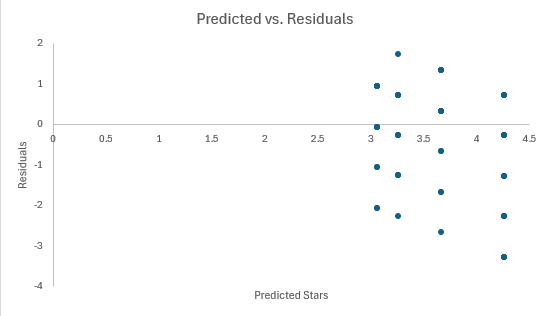

# Hotel Ratings Regression Analysis

Statistical analysis of Las Vegas hotel ratings using Microsoft Excel, correlation analysis, multiple regression, backward elimination, and residual diagnostics.

## Project Overview

This project examines which hotel characteristics are associated with average hotel star ratings. The analysis uses statistical techniques in Excel to evaluate hotel amenities, guest types, seasonal factors, and other hotel characteristics.

The goal was to identify statistically significant predictors of hotel ratings and develop a simplified regression model containing the most meaningful variables.

## Tools & Techniques

- Microsoft Excel
- Descriptive statistics
- Correlation analysis
- Multiple linear regression
- Backward elimination
- Residual analysis
- Data visualization

## Correlation Analysis

A correlation matrix was used to examine relationships among the numeric variables before developing the regression models.

## Initial Regression Model

The initial multiple regression model included all variables being tested to determine their relationship with average hotel star ratings.

The model was statistically significant overall. However, the adjusted R-squared was approximately 0.13, meaning the model explained about 13% of the variation in hotel star ratings.

Several variables were statistically significant, while many seasonal and guest-type variables had p-values above 0.05 and did not provide strong evidence of a relationship with hotel ratings.

## Backward Elimination

Backward elimination was used to simplify the model by progressively removing variables that were not statistically significant.

After removing the non-significant predictors, the final model retained:

- Pool
- Gym
- Internet

## Final Regression Model

The final model had a Significance F of approximately **3.05 × 10^-8**, indicating that the model was statistically significant overall.

The adjusted R-squared was approximately **0.11**, meaning the final model explained about 11% of the variation in hotel ratings.

All three remaining variables had positive and statistically significant coefficients:

- **Pool:** positive relationship with hotel ratings
- **Gym:** positive relationship with hotel ratings
- **Internet:** positive relationship with hotel ratings

Although these amenities were statistically significant, the relatively low adjusted R-squared suggests that many factors affecting hotel ratings are not captured by the model.

## Model Diagnostics

Residual analysis was performed to evaluate the assumptions underlying the regression model.

### Residual Distribution

The residual distribution showed evidence that the normality assumption was not fully satisfied. The residuals did not form a completely normal, bell-shaped distribution.

### Residual Analysis

The residual analysis was also used to evaluate independence and constant variance. The residuals did not show a clear repeating pattern, supporting the independence assumption. However, the spread of the residuals was not completely constant, indicating potential heteroscedasticity.

These diagnostic results suggest that although the regression identifies statistically significant relationships, predictions from the model should be interpreted with caution.

## Key Findings

- Pool, gym, and internet access were significant positive predictors of hotel star ratings in the final model.
- Backward elimination reduced the original model to three significant predictors.
- The final regression model was statistically significant overall.
- The model explained approximately 11% of the variation in hotel ratings.
- Residual diagnostics identified limitations involving normality and constant variance.
- Additional factors outside of the dataset likely explain much of the variation in hotel star ratings.

## Skills Demonstrated

This project demonstrates practical experience with:

- Data analysis in Excel
- Statistical hypothesis testing
- Correlation analysis
- Multiple regression
- Variable selection using backward elimination
- Regression interpretation
- Residual diagnostics
- Communicating statistical findings
